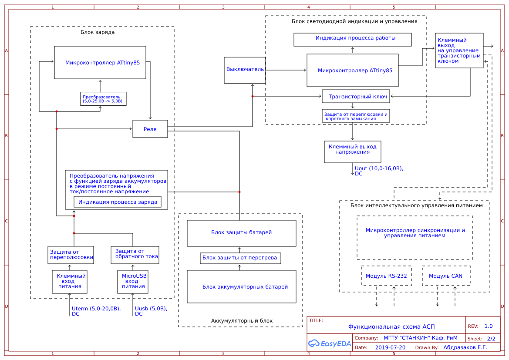

# Субмодуль питания на базе ATTiny85

Разработка аккумуляторного субмодуля питания, предназначенного для обеспечения автономной работы мобильных роботов (МР) с модульной архитектурой, автоматизированных и/или автоматических устройств и др. оборудования в качестве источника постоянного или резервного бесперебойного питания.

Функциональная схема:

